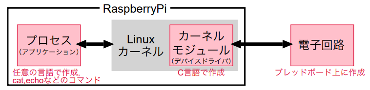
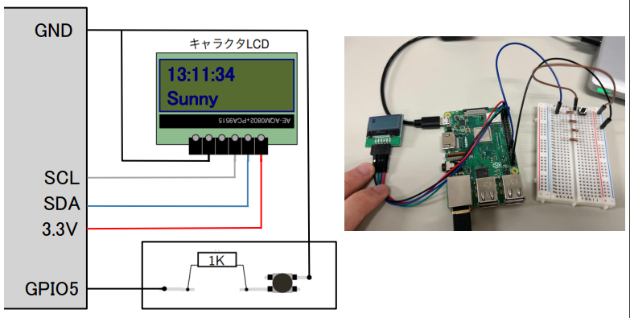
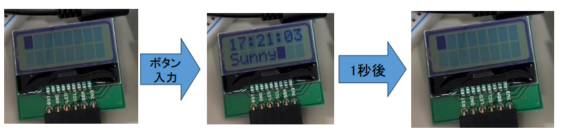
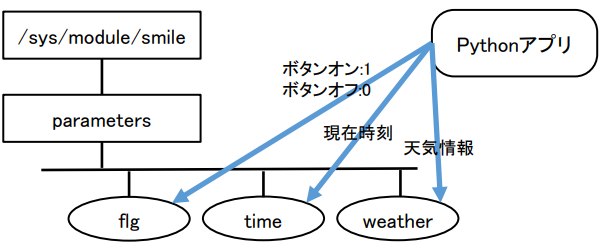

# WeatherForecastAcquisitionSystem

raspberry piに付けたボタンを押すとディスプレイに今日の天気とデータ取得時間を表示するシステムです．

## 概要

このシステムはraspberry piに付けたボタンを押すとraspberry piに接続したディスプレイにボタンを押した日の石川の天気を表示するものです．電子回路とカーネルモジュール（デバイスドライバー）とプロセス（アプリ）で構成されています．

### 電子回路
電子回路図と様子

### カーネルモジュール（デバイスドライバー）
ボタンが押されるとキャラクタLCDに現在時刻と今日の天気を表示します．flg(ボタン入力判定)，time(現在時刻)，weather(天気情報)の3つのモジュールパラメータを用いてPythonと通信し，flgが1になったらキャラクタLCDの1行目に現在時刻と2行目に天気を1秒間表示します．

### プロセス（アプリ）
ボタンが押されたら気象庁天気予報Jsonデータと現在時刻を取得し，各モジュールパラメータ(flg, time, weather)に情報を書き込みます．

## 期間
1ヶ月

## 言語と使用フレームワーク
言語：Python，C

フレームワーク：ARKit，RealityKit

## 開発環境
個人開発でraspberry piとLinuxを用いて開発を行いました．

## 制作背景
大学院の授業の一環として作成しました．Linuxのカーネルモジュール開発を目的として行いました．
